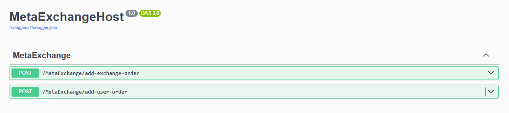

# MetaExchange

Solution for this coding task contains 2 main classes - OrderBookManager and OrderBook.
OrderBookManager is a class that 'sits' before OrderBook, it takes care of locking so that only one order can add/remove orders from order book. In real world scenario this manager class would of course be a lot larger, it would also need to 'route' orders based on their ProductPair to the correct order book, since order book is only meant to be used for one product pair. 

OrderBook contains all orders (buy & sell) for a product pair (in this case BTCEUR). We could add some additional method to it, like GetBestBid(), GetBestAsk() if we would need to get the current best prices or a spread. We could also trigger some events whenever best bid/ask price changes for example.

I also added ExchangeManager class that is currently only used to 'listen' to order book updates. These order updates could then be sent to appropriate exchanges from where they originated. 


## How to run

### MetaExchangeConsole

This project can be run by starting the "MetaExchangeConsole" project. This will start the project inside a console and you will need to 'communicate' with the program by inputing data into console directly.

Example :

```
Would you like to buy or sell?
s
How much would you like to buy or sell?
0.5
{
  "Id": 12,
  "OrderType": "Sell",
  "OriginalAmount": 0.5,
  "ExecutedAmount": 0.50,
  "RemainingAmount": 0.00,
  "AveragePrice": 2960.5534,
  "Value": 1480.276700,
  "Status": "FullyExecuted",
  "StatusChangeReason": "Unknown",
  "Trades": [
    {
      "OrderId": 12,
      "ExchangeOrderId": 1317161037436596481,
      "ExchangeId": "Exchange-0",
      "TradeId": 1,
      "Price": 2960.64,
      "Amount": 0.01,
      "OrderType": "Sell",
      "Value": 29.6064
    },
    {
      "OrderId": 12,
      "ExchangeOrderId": 6481733137595242873,
      "ExchangeId": "Exchange-0",
      "TradeId": 2,
      "Price": 2960.63,
      "Amount": 0.01,
      "OrderType": "Sell",
      "Value": 29.6063
    },
    {
      "OrderId": 12,
      "ExchangeOrderId": 3587752326102184778,
      "ExchangeId": "Exchange-1",
      "TradeId": 3,
      "Price": 2960.55,
      "Amount": 0.48,
      "OrderType": "Sell",
      "Value": 1421.0640
    }
  ]
}

```


### MetaExchangeHost

Running the **MetaExchangeHost** project/profile start the .NET Core Web API and opens the browser window with SwaggerUI. 
There you can then use two API's, **add-exchange-order** adds a new order to order book (this simulates how an order from a different exchange would be added to our 'internal' order book) and then **add-user-order** can be used to get the list of trades that will happen if we buy/sell some amount of BTC.




### MetaExchangeHost docker

By running the **Container (Dockerfile)** profile MetaExchange is started in a docker container on your local machine and browser is opened automatically which takes you to SwaggerUI page - same as with previous host option.